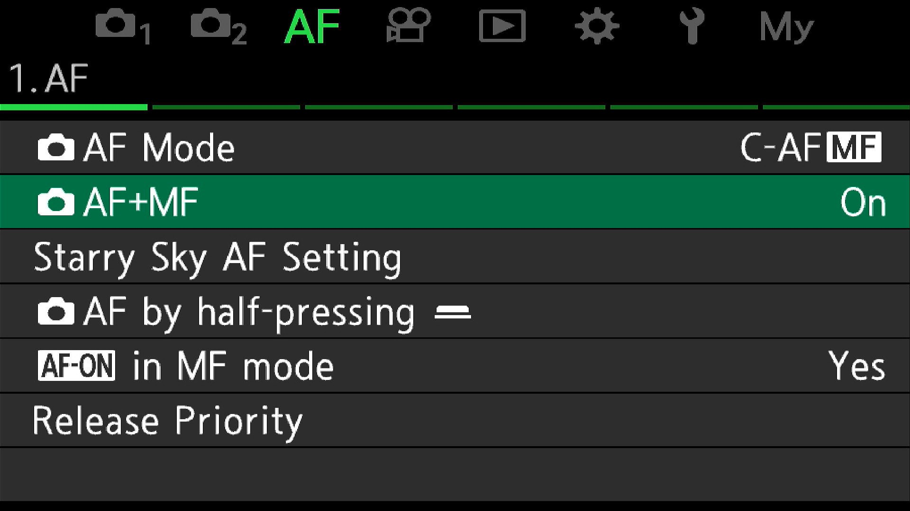
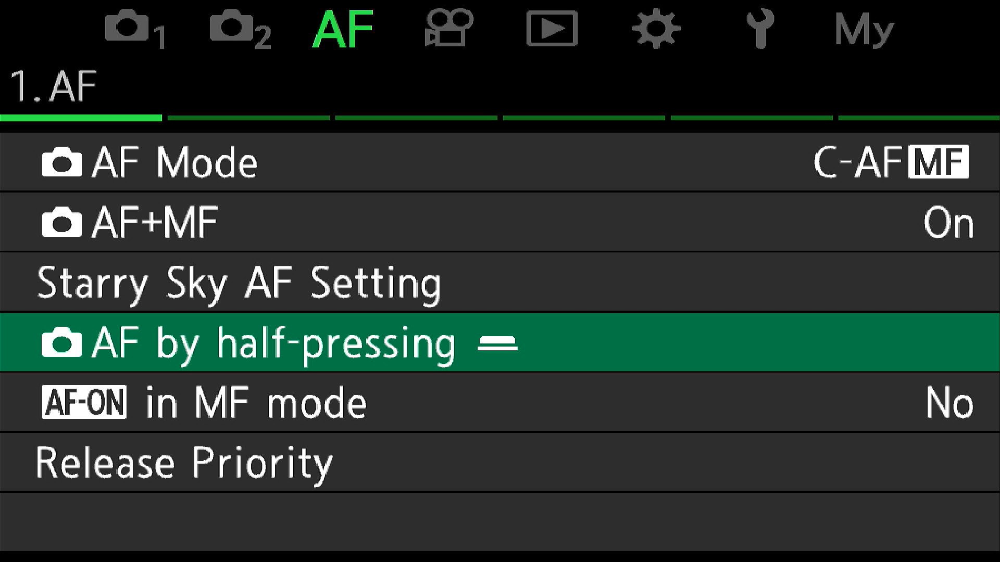
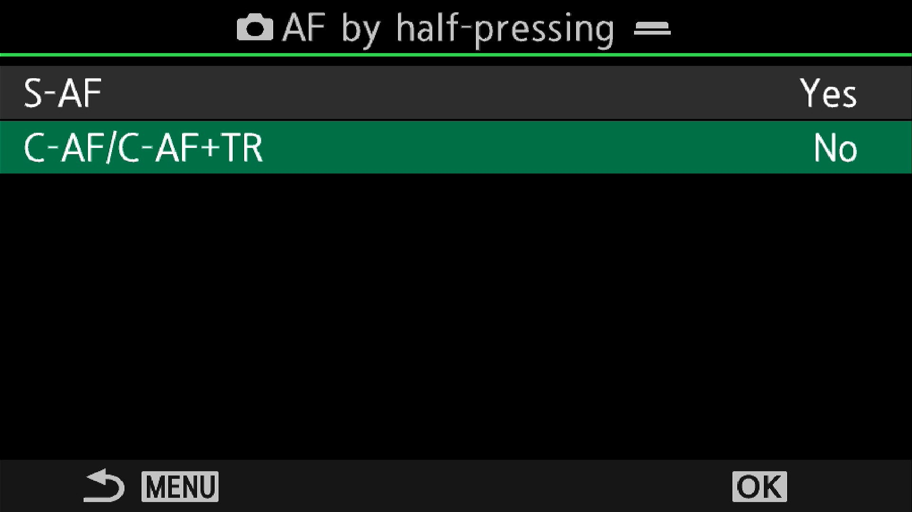
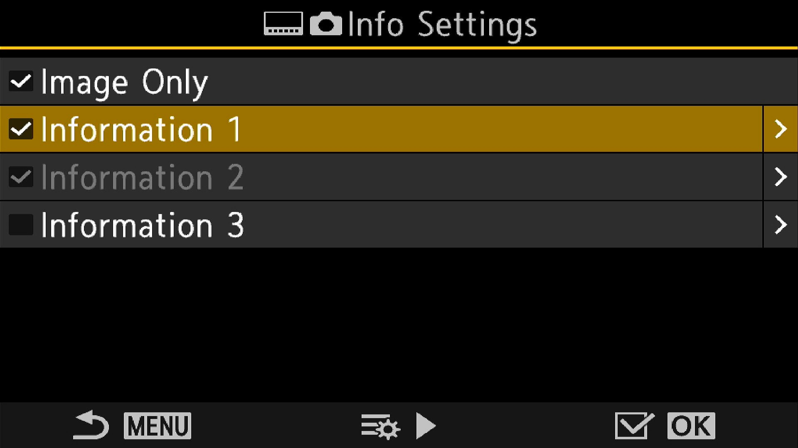
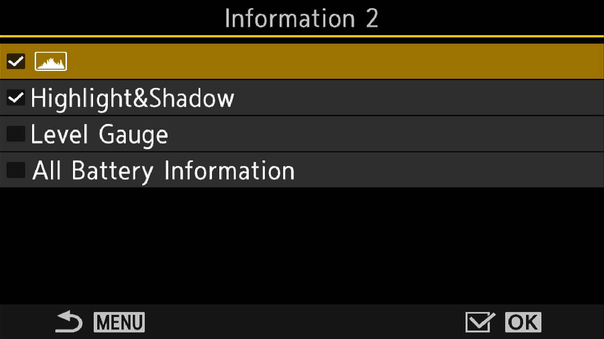
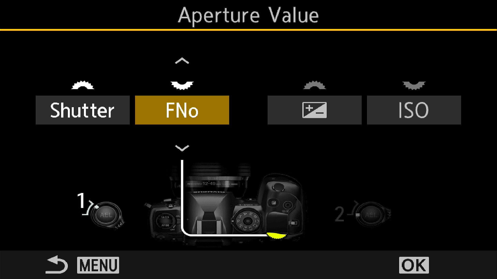
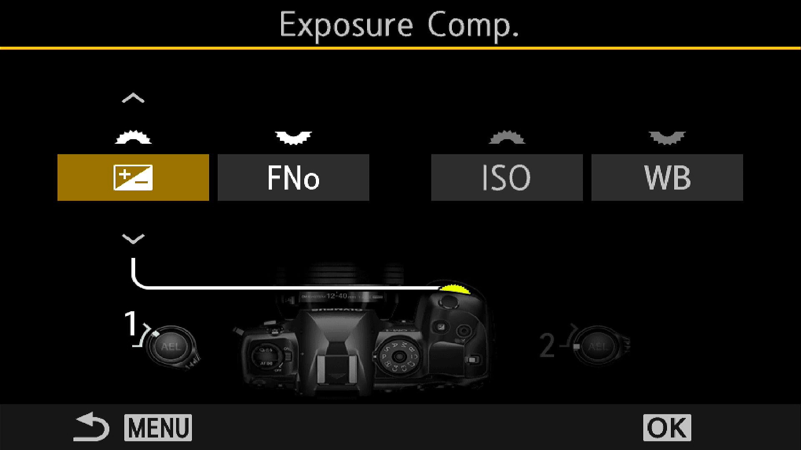
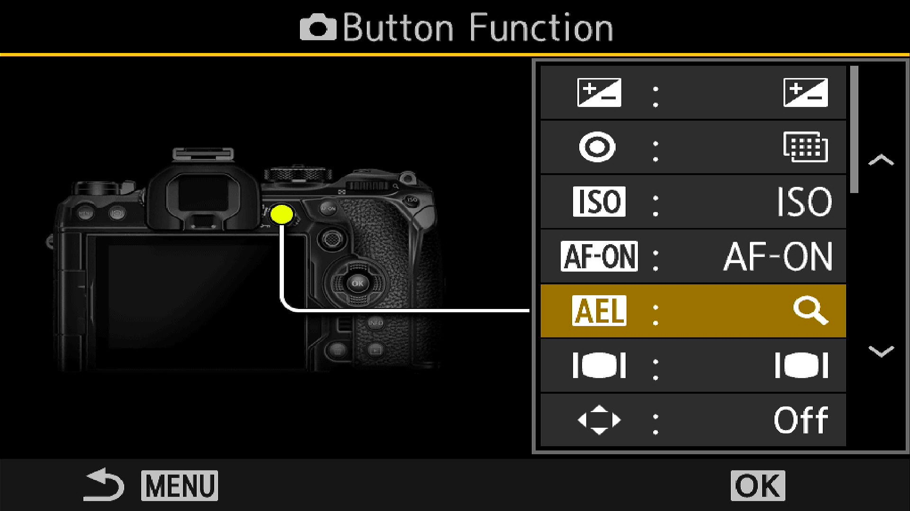
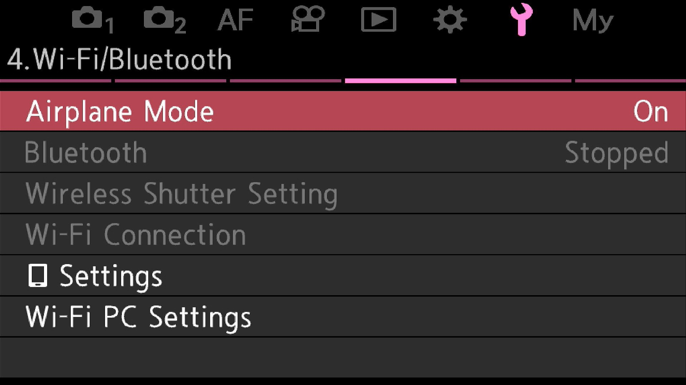
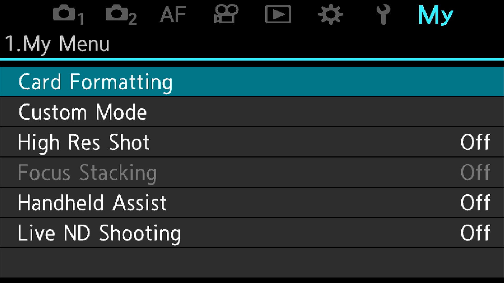

# Intro
I have had the OM-1 for over 6 months and feel like I am only just coming to grips with it. Generally, I use a base ISO of 1600, which I find most software can handle without issues when removing noise. This allows me to keep the shutter speed up in most situations. If you just want to blindly apply my settings, you can skip to the end and download my settings file, which can be applied using OM Workstation.

While the OM-1 has the excellent SH2 drive mode, which can do blackout-free 50fps RAW files, there are some downsides to using it. Firstly, it affects the EVF preview; generally, the scene looks darker in the EVF (it doesn't change with exposure changes). For this reason, it's important to read the histogram for exposure when using it. The other downside is you cannot drop the shutter below 1/640th of a second. This is no problem for birds in flight, but it is a limitation when shooting perched birds in dark forests. Remember, the OM-1 has excellent IBIS, which I use down to 1/40th of a second safely; this really helps to keep ISO down.

These settings suit my style of getting the most out of the OM-1. I expose to the right of the histogram, which produces a very bright image. However, once pulled down in post, it shows minimal noise. I'm always looking at the histogram in the EVF; learn to read it.

Tip: The histogram has a white area that represents the whole scene, but within that, there is also a green area that represents your focus area (usually a bird).

# Prerequisites

## Perform a factory reset
Even if your camera is new, or especially if it is used, perform a factory reset. I have had unknown settings affect my C-AF autofocus accuracy. Shoot with factory settings and change only the required settings with regard to autofocus.

## Upgrade firmware
This article assumes firmware v1.7, which makes the `All` focus points with bird detection more usable.

Note: During firmware updates, shutter speed in all modes, date, and language are usually lost and need to be reset.

# Global settings
These are settings I keep the same through all the Custom modes or globally.

## Miscellaneous Settings
No one needs the AF light on the front of the camera for distant birds; it's just a distraction.

## Picture Settings
I always shoot RAW only. Ensure this is set; the default is a medium JPEG. Here is a general overview of the Super Control panel; you can access this by pressing `ok`. This is also how you can quickly change settings not controlled by buttons or dials.

## Autofocus Settings
For birds, I'm always in C-AF+MF. I use back button focus and disable the focus on a half-press.

These settings allow manual focus override while still using autofocus. It can be handy when the camera gets confused and focuses on the wrong thing.

This setting puts boxes around the bird, the bird's head, and hopefully the bird's eye. I use `on1` as opposed to `on2`, which also shows green boxes over the focus area. I really try to look for the head and eye boxes before pressing the shutter; `on2` tends to get in the way.

Back button AF is enabled by default, but so is focusing by half-pressing the shutter button. I disable the half-press shutter button AF and just focus with the `AF-ON` button on the rear of the camera.

## EVF Settings

### Highlights & Histogram
Once the following have been set, press the `info` button on the back of the camera to enable it. I actually set these in information 2 (not 1 as in the second image). To test, you should see the histogram in the EVF, and if you overexpose and clip highlights, they should turn RED. If you underexpose and clip, they will turn BLUE. The objective is to overexpose your shots but not clip in RED.

### Grid colors
Coming soon - I find the standard green boxes are very hard to see in many of the environments I shoot in. You can change the box color to produce more contrast when out shooting.

## Buttons and Dials
The `front dial` is always set to change the shutter speed. The `back dial` changes the aperture (if in manual mode) or exposure compensation if in shutter or aperture priority. I try to keep them as consistent as possible so when I change modes, it feels natural.

For Manual-based settings (C1)

For Aperture-priority-based modes (C2)

For Shutter-priority-based modes (C3)

### Toggle switch
In each custom mode below, I use the toggle switch to quickly change the number of focus points. In the first position, `All` focus points are selected, and in the second position, a single AF point is selected for those difficult situations. In each custom mode, you need to change the EVF view, Autofocus drive mode, etc., then save the mode.

### AEL
I assign this to magnify. Once pressed, you can zoom in or out using the front dial. To exit, hit the `ok` button. I find this really useful even if I'm not particularly going to take a photo of a bird but rather just identify a bird.

## Wifi/Bluetooth/Airplane
I turn these off by default (by turning airplane mode on) and only enable them if needed. This helps save battery.

# Custom Modes

## C1 - General Birds, Perched Birds
I use this mode based on the `manual` mode; this allows independent control of the shutter speed and aperture. I use this mode most of the time now as long as the bird stays in the same lighting conditions.

- Exposure mode - Manual
- Subject detection - Birds
- Autofocus mode - C-AF + MF
- ISO 1600 - This can be changed
- Drive mode - Silent sequential - 20fps
- Shutter speed - 1/500th
- Meter mode - ESP

## C2 - Birds in Flight
I use this mode based on the `aperture priority` mode when shooting birds in flight. It adjusts for exposure changes faster than I can in manual modes. It allows independent control of the aperture (rear dial), which I rarely use as I keep it wide open, but allows exposure compensation to be used with the front dial.

- Exposure mode - Aperture priority (wide open)
- Subject detection - Birds
- Autofocus mode - C-AF + MF
- ISO 1600 - This can be changed by holding down the ISO button and adjusting with the front dial
- Drive mode - SH2 - 50fps
- Shutter speed - Auto selected
- Meter mode - ESP

## C3 - Pro-Capture
I use this mode based on the `shutter priority` mode to shoot birds about to take off or land on a perch. It allows independent control of the shutter (front dial) and allows exposure compensation to be used with the rear dial.

- Exposure mode - Shutter priority
- Subject detection - Birds
- Autofocus mode - C-AF + MF
- Auto ISO (up to 12800)
- Drive mode - Procap SH2 - 50fps
- Shutter speed - Start at 1/2500th
- Meter mode - ESP

# MySets
I use this menu, right at the end, to easily access settings that are buried in the menus. They are like shortcuts but usually not used for birds.

# Troubleshooting
I noticed at one stage my C-AF accuracy decreased for unknown reasons. I tested by taking a photo of my monitor at minimum focusing distance, single AF point. One shot in C-AF mode and one in S-AF. The C-AF mode was notably softer than the S-AF. I could not track down the settings, but doing a factory reset and applying the settings on this page fixed the issue.

# Download my settings
All bird modes are operated with C1, C2, and C3. I have reset the other modes like A, S, and M for general purpose shooting, travel, landscapes etc. When shooting those I generally use single shot S-AF, no subject detection, single point AF, but still the electronic shutter.

The following can be restored in OM Workstation. If you experience issues or thing appear worse, perform factory reset and apply the settings manually.

[OM-1 Saved Settings](../assets/img/OM-1/OM-1_20240907.set)

