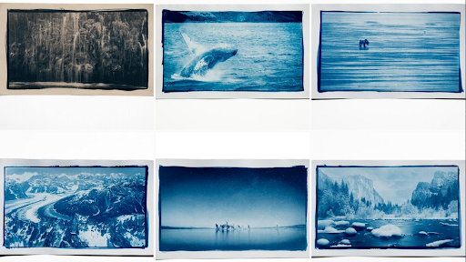
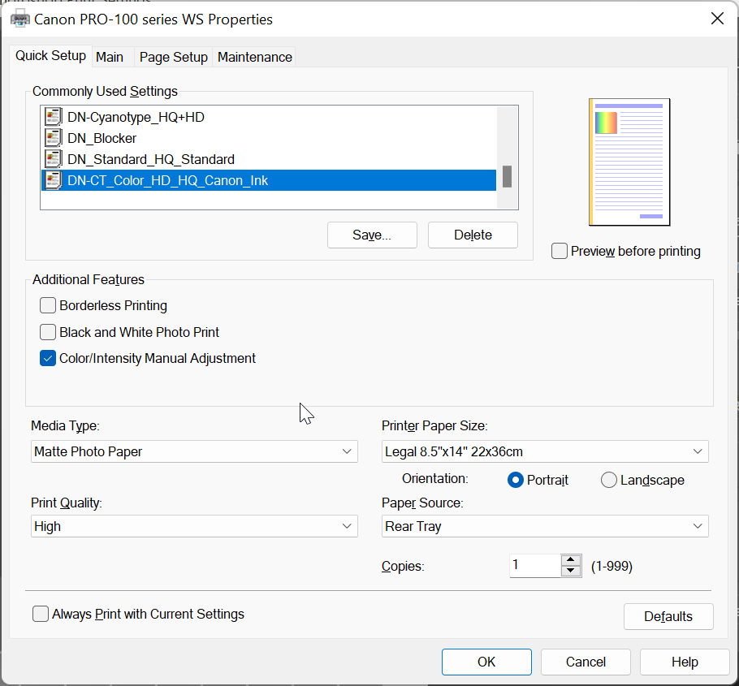
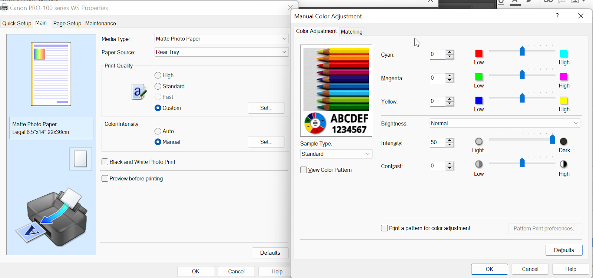
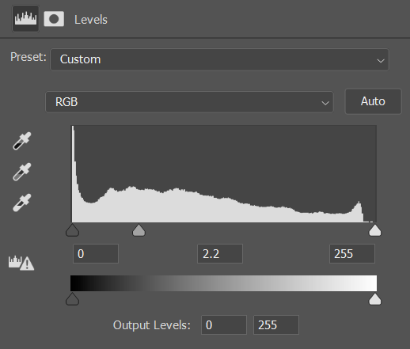
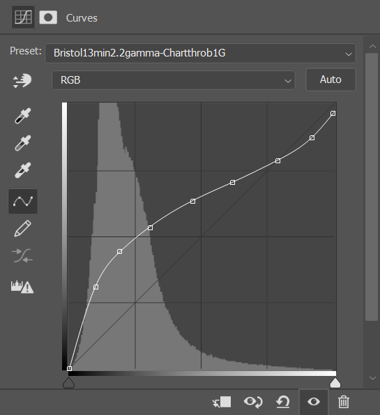
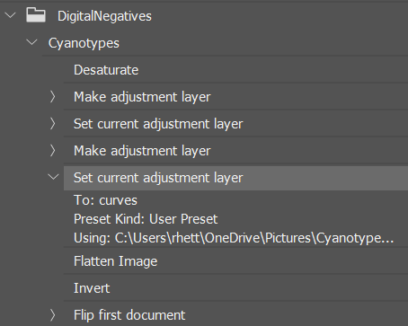
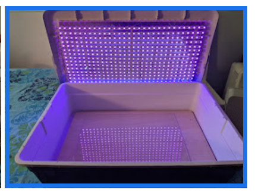
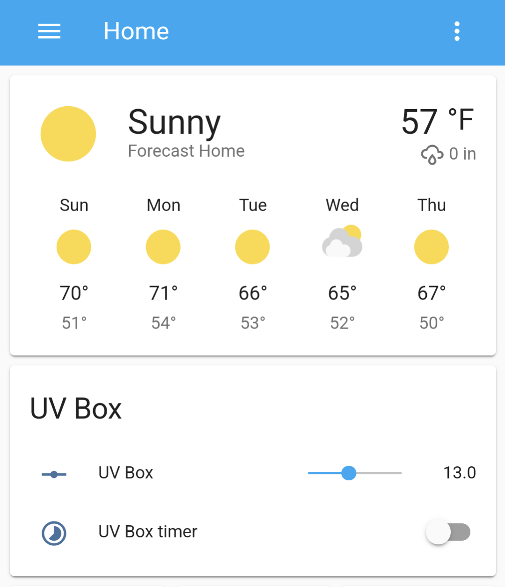

Cyanotypes are meant to be the no-brainer of alternative printing but there is still some not so obvious requirements and many.. many variables.

This is a record of all the mistakes I have learned with my Cyanotype and digital negatives experimentation. 

General note: If results are undesired or unpredictable, its best to start over with good quality materials. I.e. Don’t cheap out on things like papers, expired chemical, printers/inks, transparencies etc. It can cause more work, frustration and end up costing you more in both money and time. I’m speaking from experience.

# EXAMPLES
Some [examples](https://imgur.com/a/NVG5mCV) of my cyanotypes after refining my process

# CHEMICALS
## Mixing
I’m using the standard “classic” chemicals - [Jacquard](https://www.amazon.com/gp/product/B010MN312S/ref=ppx_yo_dt_b_asin_title_o01_s00?ie=UTF8&psc=1) and mix with distilled water only. Leave it sit for 24 hours before using and mixing.

⚠️ Part  B can develop mold in the solution over time. This can be removed by running it through coffee filter

## Expiry - Old vs New chemicals
Does this change any variables? I’ll update this section when I mix a new bottle. Update: I have not seen anything in my prints between different ages of chemicals. They last months to years.

# PAPER 
I have tried the following papers. I acknowledge that using more expensive 100% cotton papers is considered the best.

## Canson XL watercolor
Nice texture on the paper, I get very little highlights and midtones with it using tap water as a developer. Switching to a very dilute vinegar smoothed the texture.  I coat on the smooth side once only. Use 1 hour after hanging to dry in a dark room (server room)
The best result for me is to develop with  30ml vinegar to 800ml water with this paper.

## Canson XL recycled bristol
✅This paper is brighter and feels a bit lighter. It holds deep blues and is my current preferred choice between the 2 Cansons. Be sure to use the rougher side (up side) for deeper blues.
I get it from [Michaels](https://www.michaels.com/canson-xl-recycled-bristol-pad/M10157082.html?dwvar_M10157082_size=14%22%20x%2017%22&dwvar_M10157082_color=White) and order a larger size and cut it down to save on cost.

💡Its possible to acidify papers before use. Links down in the reference area. I am currently not doing this

# COATING APPLICATION
Always shake up the bottles before applying to paper.
Before applying the emulsion, wet the brush first and shake it out, dry off any other water with a paper towel.
When applying the emulsion, have the paper towel handy and dab any extra emulsion into it.
The relative humidity of the environment you are coating the paper in should be about 60%. If it’s significantly less this can affect the midtone. Try soaking the paper in water, drying, and then coating it, to see if that helps. You can also hold the paper over a pot of boiling water or hang it in the bathroom before taking a shower.

# Brushes
## Foam
Probably the easiest to start off with, very even coating.  Mix 2 + 2ml for a standard 9x12 sheet of paper. Make sure this all soaks in else you will not get the deeper blues. Work it for about 2-3 mins.

## Hake
[These](https://www.amazon.com/dp/B08TTJ2BYT?psc=1&ref=ppx_yo2ov_dt_b_product_details) seem good if you want fancy brush strokes on the page edges

## Standard Home Depot
Much harder to control and uses/soaks up more sensitizer. This is my last choice

# DIGITAL NEGATIVES
There is a lot to learn with the digital negative process. I have mostly learned from The Easy Digital Negatives book, but there are other methods listed like Charthrob and Tom Nelsons links. After going through all processes I would now go to Tom Nelsons process. 

**Update, my current method is more based on Tom Nelsons method using Charthrob**. Before starting with charthrob I add a levels adjustments and set gamma/mid point to 2.2 on the positive image. This reduces the severity of the corrections a LOT.

Tip: If you have tried everything and still cant get a good print, try to eliminate the digital negative as a culprit of issues, use a standard step wedge or a real film picture. 

# Printer
There is a lot of talk about Canon printers (Pixma Pro 100 which I own) not being up to the task. [This user](https://www.photrio.com/forum/threads/digital-negatives-on-canon-pro-100.152681/) has made it work successfully. And based off that work I have made it work for my workflow too.

“At first I was having trouble getting enough UV density with the black and white mode but printing as a color image, with intensity pushed all the way up and with Matte paper selected, I'm getting pretty good density.”

Alternatively there are inks available for the pixma pro 100 for screen printing. https://solutionsforscreenprinters.com/pixma-pro-100/

For best results an Epson printer using the K3 or Ultrachrome inks is the standard for Digital Negatives. When it comes time to replace my printer, I will be looking for an Epson. 

🚨Canon inks are highly recommended/required if using a Pixma Pro 100

# Inks
## Precision Color
I tested a Canon Pixma Pro 100 printer with 3rd party [Precision color inks](https://precisioncolors.com/). I can get a maximum density of 1.0 under a densitometer with this ink. This of course does not measure the UV blocking ability of the ink but it gives a general idea. 

🚨This ink is not suitable for digital negatives.

## Canon
Canon Ink measured a density of 1.62 under densitometer. This ink gives a far greater tonal range. 

✅It is the only ink which is up to the task for this printer.

# Transparency
I’m using [Fixxons Waterproof Inkjet](https://www.amazon.com/dp/B07ZHPC9LH?psc=1&ref=ppx_yo2ov_dt_b_product_details) transparencies after watching Tom Nelsons comparison [video](https://www.youtube.com/watch?v=7fzAOhTls_o). This is a fraction of the price and holds a lot of ink. I measured the density of this vs a generic non milky i.e. clear brand it it held about 10% more density using the precision color inks. I have not tested with Canon inks.
 
# Printer Settings
## Media Selection
In the print driver settings, ensure to use “Matte Photo Paper” as the Media type. Print quality is set to high

## Density
Under the “main” tab ensure set the Color/Intensity to Manual and make sure the intensity is all the way up. You will need to find the right density, that is the value it takes not to completely block up the highlights on your step wedge once printed.

🚨Do not print as a B&W photo. Make sure you print using RGB (including the mode of the  photo within photoshop)
Once printed allow the negative to dry for about 1 hour.

# Optimum UV blocker
To find the optimum blocker color follow [this](https://www.youtube.com/watch?v=0g600pBatJg) process. Print the chart with the standard print time i.e. the time is takes to reach maximum darkness. Once the process has finished you will get multiple corrections you can apply to photoshop. It is recommended to use the LUT/color lookup process but I fell back to curves. LUTs seem hard to edit, and color gradients do my head in.

[http://www.easydigitalnegatives.com/color-blocker/](http://www.easydigitalnegatives.com/color-blocker/)

In my sample using 2 caps of vinegar in water exposed for 11 mins, the black gradient gives the longest tonal range and still blocks the highlights.

## Gamma

🚨Setting gamma provides a better starting point and reduces the steepness of the curve.

“The gamma needs to be increased to a value in the region of 1.8 to 2.2 in the positive image, which – be warned! – will then appear horribly overexposed in the digital sense, or ‘blown out’ on-screen. This adjustment usually suffices to re-map the relative distribution of levels from most positive digital image files to provide, on inversion, a negative with sufficient density to be printable by analogue processes.”

# LUTS/Gradient Maps/Curves
There are  few different way to apply adjustments to a digital negative. I am currently using Charthrob after applying the 2.2 gamma level to the positive image. After printing the stepwedge, then scanning it back in and processing it. I ended up with this curve

## Printing

Cyanotype photoshop process - THE ORDER IS IMPORTANT. I highly suggest making a photoshop action once your process is down to eliminate human error.

1. Import photo
2. Edit as desired
3. Desaturate
4. Apply the color gradient map/LUT/curve/gamma etc (normal blend). Do this while its still a positive.
5. Flatten the image
6. Invert the image
7. Flip horizontal
8. Print using your saved printer settings preset

# EXPOSURE

## Find the exposure time
I like to break this down into 2 steps. First run is with large time increments of 5 mins. Run way over time what you expect the and think in stops (double, double again etc). I was certain my exposure time was abou 11 mins with the development method I was doing. I ran another test strip with 5,10,15,20,25 mins. I re-evalutated an decided my actual time was somewhere in between 15-20 mins. This equates to most a stop of tones which are really needed in the midtones. After printing the step wedge again I found my shadows too deep and dropped my time back to 13 mins.

## UV Exposure box
### LED selection
According to all research at the time of writing the SMD5050 Led (in strips) are the only LED’s powerful enough to expose alternative prints. They are on the upper side of the UV spectrum at 395nm. 

People are now using 60W-100W+ LED 360nm odd floodlights which develop the prints much faster (1 min vs 13). The issue I have with these is the light is not contained in a box. I try to limit the exposure of UV light to my eyes as much as possible

### UV Lightbox Build
I follow the instructions from [this](https://www.youtube.com/watch?v=rBBAUWRy0Mc) Youtube video. This allows full power and half power. Maximum print area of my box is 13x19 which is the max my printer can create digital negatives

I added a timer on with Home Assistant. It turns on for the selected time, turns off and sends a notification to my phone. You could use a darkroom timer for the same functionality.

# Glass vs Acrylic
When talking about the material to place on top of your digital negatives there are a couple of choices. Glass plate blocks a lot of UV light but has the advantage of being heavy which helps flatten the paper and negative. Acrylic (not plexiglass) will let the upper end of UV light through and is only half the weight of glass. I currently use a 13x19 piece of 3/8th cut from Tap Plastics mainly because it was easy to source and cut.

🗒️The weight of the material doesn’t matter if you clamp glass/acrylic to the base with the paper and digital negative sandwiched in between.

🚨If you get blurry parts on your prints this could be due to not clamping, or the surfaces not being 100% flat. I used an old bit of plywood for the base, and one side was slightly concave which produced parts of the images to be blurry. I flipped the base so it became convex and that solved the issue.

# DEVELOPING
When developing, prepare your developer before hand, be that water or a dilution of vinegar and place in a container you can pour over the cyanotype. You want even development which requires the whole print to be covered within the same second or two. Failing to do this can result in lines on the final product.

## Tap Water 

💡If you have limited tones in the midtones and highlight, you can use vinegar in development and wash to extend them.

The pH level of your water has a huge impact on your midtones. My midtones were washed out and showed fibers but this could be due to a number of other variables as well. My tap water here reports an average Ph of 8.1. Prussian Blue has an in depth video on this.

| Water | Notes |
|-------|--------|
| 1000ml | 12min exposure time. This naturally produces a very contrasty print which is hard to pull back | 

## Vinegar
Vinegar greatly changes the curve of the print. Cyanotypes prefer to be on the acidic side. 
You can dilute the vinegar with tap water, this way it still remains on the acidic side.
Observations. Unless otherwise stated testing was performed with Canson XL watercolor paper. 

| Water | Water | Notes |
|-------|--------|--------|
| 1 | 0 | 3 mins. Lots of tone and drastically reduces the exposure times. Stains the highlights blue |
| 1 | 3 | ✅25% vinegar, this is what I settled on with a 13 minute exposure on Bristol paper. |
| 1 | 8 | 10 mins seems to be about right. Still is little light, doesnt hit the deep blue. Note this could be inaccurate |
| 15ml (1 cap) | 800ml | 11min exposure. Takes Hydrogen Peroxide but washes would the highlights. Nice and deep blues. |
| 30ml (2 caps) | 800ml | 20 mins 15 mins exposure. Good compromise between tonal range and deep blues. Can be used with hydrogen peroxide. |
| 50ml | 800ml | 15 mins exposure.Can be used with hydrogen peroxide. Blue not as deep |
| 100ml | 800ml | Tested on bristol paper for 15 mins. No highlight staining. Can be used with Hydrogen peroxide |

Develop for 5 mins to protect from bleaching during wash.

## Distilled Water
This will be pH neutral. I have yet to experiment with this. This should eliminate any bleaching during the wash.

# WASHING

## First wash
Place in a tray with normal tap water + 10ml of vinegar for 5 mins. Empty the water and fill again, immediately add a squirt of Hydrogen Peroxide force oxidation. Allow to oxidize for 1 min

## Second wash
If you wash with normal tap water which is basic (like mine) this step will continue to bleach the highlights and mid tones. My current consists of running it under tap water for 30 seconds. Be consistent!

This is an [excellent demonstration](https://www.photrio.com/forum/threads/the-effect-of-acid-in-the-washing-of-traditional-cyanotypes.177366/) of the bleaching effect of alkine washing water 

# BLEACHING/TONING

## Bleaching
It's often best to over expose if you plan on bleaching. I use washing soda but make sure you don't use too much as it reacts fast.

Without bleaching, you can get blacks in your shadows. With bleaching, you get browns in your shadows.

## Coffee
Temperature. The hotter the coffee is more it reacts especially staining the highlights. Its better to have a lower reactive coffee at room temperature.

| Coffee | Temp | Time | Notes |
|-------|--------|---------|---------|
| Black brewed | Room | 5 mins | Less staining than tea, Still a split tone at this stage. No Bleach. |
| Black brewed | Room | 10 mins | A slight bleach first then 10 mins. Drys with a slight Blue but mainly neutral tone. |
| Black brewed | Room | 30 mins | Very deep brown, major highlight staining, suits some prints |

## Tea

| Tea | Temp | Time | Notes |
|-------|--------|---------|---------|
| Lipton black - 4 bags  to 1l | Room temp | 5 mins | Stains the highlights a bit.Split tone |
| Green tea | Warm | 30 mins | 1.2L of water and 8 bags, a slight bleach (15-30 seconds) before toning |

Wine Makers Tannin
https://www.photrio.com/forum/threads/paper-for-cyanotypes-an-incomplete-survey.175743/page-2#post-2381750

## Tannic Acid

# TROUBLESHOOTING
## Midtones
This is a collation of the points mentioned above which affect your tonal range

1. Ph of water used to develop. Add acid during development. This will extend the midtones and highlights tonal range
2. Paper selection. 100% cotton is best as it is pH neutral
3. Relative humidity when coating. Around 60% or more
4. The exposure time. The printer and inks used for a digital negative. Epson inks block UV light better.
5. The printer settings. Increase the print density and increase exposure to get more separation between tones.

Notes on midtones. “Ive found too if the negative doesn't have enough uv absorption the mid to white tones cant be calibrated well as theres not enough numerical separation between each step in the scale. I punched up the ink density on mine and got way better tones but then started having banding problems from the substrate not holding the ink as well.”

## Highlights
When printing your digital negative, if the highlights have tones (not a bright as they should be) then add more density to the digital negative via the printer settings. If there is a large white area at the bottom the step wedge, decrease the print density.

## Shadows
This is generally controlled by the exposure time. If you have too many shadows after corrections, then try decreasing time.

# REFERENCES
- [Prussian Blues](https://www.youtube.com/user/matthewbary1) - Experimenting with papers, UV enlargers, Vinegar developing etc. This channel is full of useful information.
- [https://www.youtube.com/watch?v=y00DU5OOqaQ](Lauren Fiebert) - Start to finish Cyanotype process including bleaching and toning in a single session
- [Tom Nelson](https://www.youtube.com/watch?v=7fzAOhTls_o) - Fixxon vs Pictorico
- Tom Nelson - [Creating a Digital Negative](https://www.youtube.com/watch?v=nPoZt4-yzy4)
- [Charthorb](https://www.botzilla.com/gearhead/2006/10/24/ChartThrob-A-Tool-for-Printing-Digital-Negatives.html) - Automated curve generator
- How to set up digital negative [Gradient maps](https://www.youtube.com/watch?v=xdVuAHLvXOg&t=838s)
- [Paper comparisons](https://www.alternativephotography.com/papers-for-traditional-classic-cyanotype-process-1613-research-for-free/) - Christina Z. Anderson 
- [Another paper](https://www.photrio.com/forum/threads/paper-for-cyanotypes-an-incomplete-survey.175743/) list
- [Peter Mrhar](http://www.photomrhar.com/portfolio/cyanotype/) - Cyanotype process including paper comparison
- [Bostick & Sullivan Digital Negatives](https://www.photo-historica.com/digitalnegatives) 
- [Cyanomicon](https://www.mikeware.co.uk/downloads/Cyanomicon.pdf) - Free e-book 
- [Sulfamic-acid-for-paper-acidification](http://sulfamic-acid-for-paper-acidification/) 
- [UV Exposure box build](https://www.youtube.com/watch?v=rBBAUWRy0Mc)
- [Mat Hughes](https://viewcameraaustralia.org/2022/10/01/folio-mat-hughes/) - Excellent cyanotype examples

